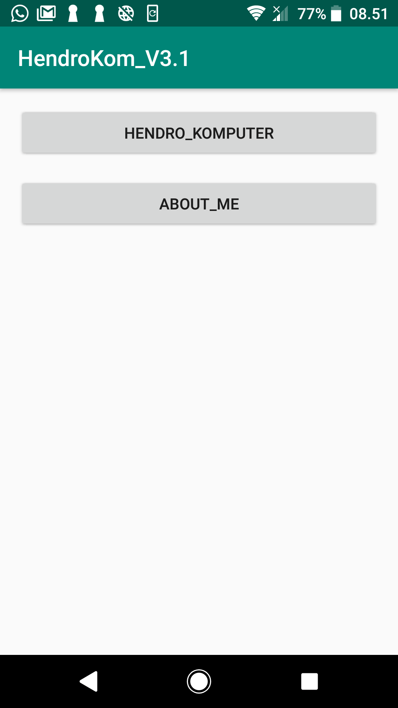
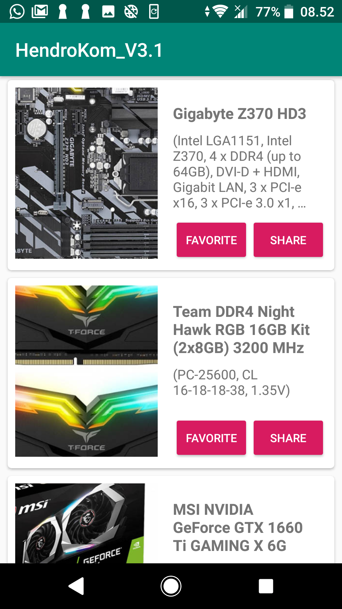
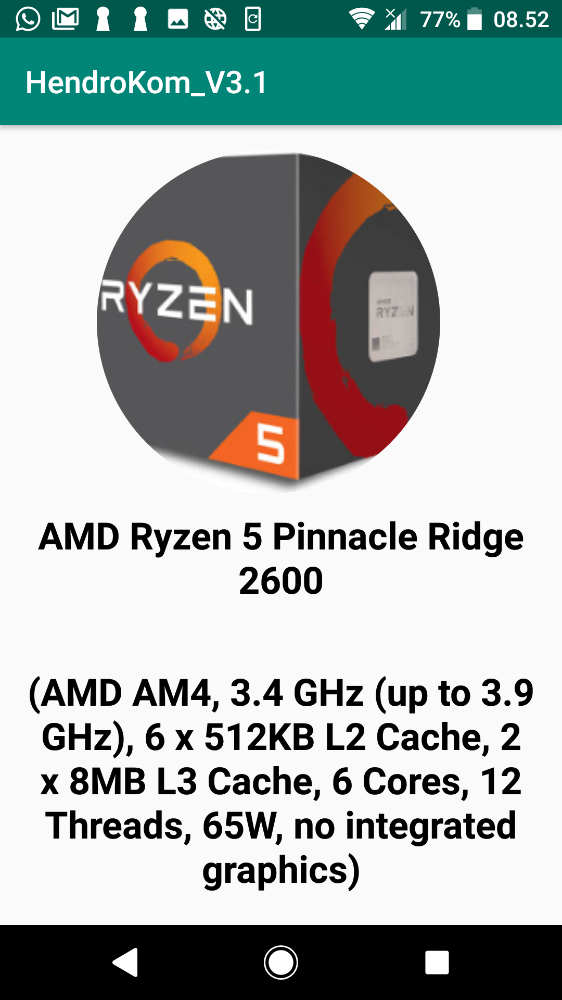

# PartKomputer_V3.1

tugas submission aplikasi android dicoding 
This is submission from dicoding.com online course, "Kelas Belajar Membuat Aplikasi Android untuk Pemula". Create app for show the list of Part PC Computer using RecyclerView.

- Menampilkan gambar dan informasi dalam format List dengan jumlah minimal 10 item.
- Memunculkan halaman detail ketika salah satu item di tekan.
- Menampilkan gambar dan informasi pada halaman detail.
- Menampilkan foto diri, nama dan email pada halaman about.

